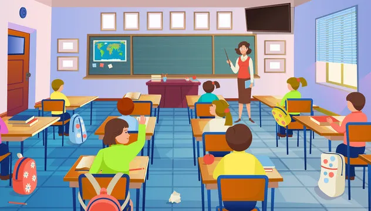

### 2ahitm - SEW - 3. Testvorbereitung- 2024-04-07
## Themenschwerpunkte
* Suchalgorithmen
* Sortieralgorithmen
* Vererbung
* Comparator, Comparable

## 1. Ausgangssituation

+ Sie erhalten die Aufgabe zur erstellung eines Klassenzimmers.

  

## 2. Aufgabenstellung

* Erstellen sie alle Klassen anhand des Klassendiagramms.

* Zum Testen der Klassen sind Unit-Tests beigegeben. Diese sind auch Teil der Angabe.

  
### Erbbare Klassen
* Ein Klassenzimmer besteht aus einer Anzahl an Schülern. Ein Schüler hat folgende Eigenschaften.

  | Attribut         | Beschreibung                                                                                |
      |------------------|---------------------------------------------------------------------------------------------|
  | ``int studentid``    | Bei der Schüler Id soll man einen Wert von 1 bis zur Anzahl der Schüler nehmen.             |
  | ``String classname`` | Man kann bei jedem 2AHITM nehmen oder zufällige.                                            |

* Definieren Sie eine Klasse Student mit folgenden Methoden:

| Methode           | Beschreibung                                                                                |
|-------------------|---------------------------------------------------------------------------------------------|
| ``Konstruktor   ``    | Ein Defaultkonstruktor und einer mit allen Attributen. Mit Ihnen erstellt man einen Schüler |
| ``Getter und Setter`` | Die Getter und Setter für alle Methoden.                                                    |
| ``compareTo``         | Eine CompareTo Methode von der implementierung des Comparable(Student).                     |
| ``toString ``         | Ausgabe von allen Daten.                                                                    |

* Ein Klassenzimmer wird geleitet von einem Lehrer. Ein Lehrer hat folgende Eigenschaften.

  | Attribut       | Beschreibung                                  |
      |----------------|-----------------------------------------------|
  | ``int classes ``   | Anzahl an Klassen die der Lehrer unterrichtet |
  | ``String subject`` | Das Fach welches unterrichtet wird            |

* Definieren Sie eine Klasse Teacher mit folgenden Methoden:

| Methode           | Beschreibung                                                                                |
|-------------------|---------------------------------------------------------------------------------------------|
| Konstruktor       | Ein Defaultkonstruktor und einer mit allen Attributen. Mit Ihnen erstellt man einen Schüler |
| Getter und Setter | Die Getter und Setter für alle Methoden.                                                    |
| compareTo         | Eine CompareTo Methode von der implementierung des Comparable(Student).                     |
| toString          | Ausgabe von allen Daten.                                                                    |

+ Erstelle noch eine Klasse Person diese wird die Superklasse des Student und Teacher.
+ In Person werden wichtige Attribute mitgeben, Name, Age, Weight, Size, Gender.
+ Das Geschlecht kommt aus einem Enum mit den Werten MALE, FEMALE

### Comparator Klassen

+ Es sollte Klassen geben zu vergleichen von bestimmten Werten.
+ Diese Werte sind Age, Name, Size und Weight
+ Erstelle deshalb AgeComparator, NameComparator...

### Enums

+ Es gibt insgesamt 3 Enum Klassen Gender, SearchType. SortType
+ In Gender gibt es MALE, FEMALE
+ In SearchType gibt es LINEAR, BINARY
+ In SortType gibt es BUBBLE, SELECTION, INSERTION

### Main
+ In der Main Klasse wird alles ausgeführt
+ In der Main wird etwas vorgefertigter Code sein, zur Erstellung von Methode und festen Werten

## Ausgabe
````
Unsortiert

My Stats are (187 cm, 57 kg, 54 y, Nele Rokossa)
My Stats are (160 cm, 62 kg, 16 y, Julia Bock)
My Stats are (175 cm, 82 kg, 15 y, Prof. Dr. Jayden Huhn)
My Stats are (177 cm, 60 kg, 16 y, Jane Schellenbeck)
My Stats are (154 cm, 63 kg, 15 y, Valeria Hugo)
...
````
#
> **Tip:** Kommentieren Sie die Unit-Tests schrittweise ein und überprüfen Sie Ihr Programm
#
````
____   ____.__       .__      _________                          ._.
\   \ /   /|__| ____ |  |    /   _____/__________    ______ _____| |
 \   Y   / |  |/ __ \|  |    \_____  \\____ \__  \  /  ___//  ___/ |
  \     /  |  \  ___/|  |__  /        \  |_> > __ \_\___ \ \___ \ \|
   \___/   |__|\___  >____/ /_______  /   __(____  /____  >____  >__
                   \/               \/|__|       \/     \/     \/ \/
````